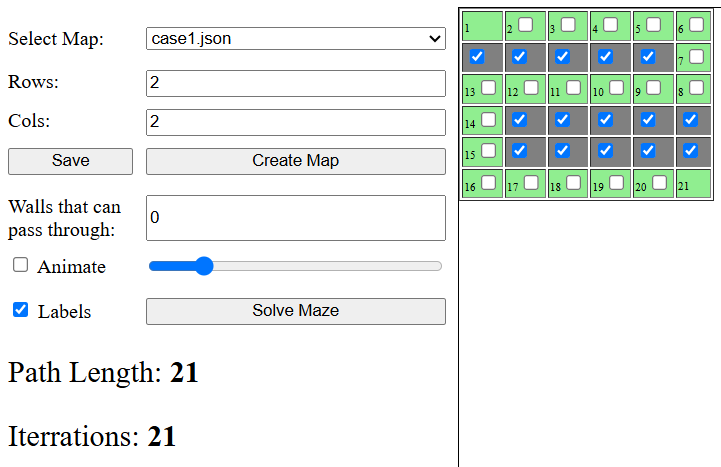
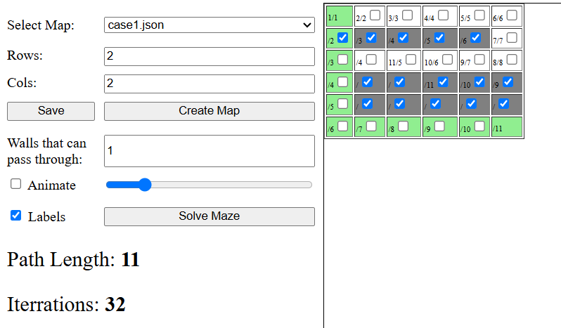
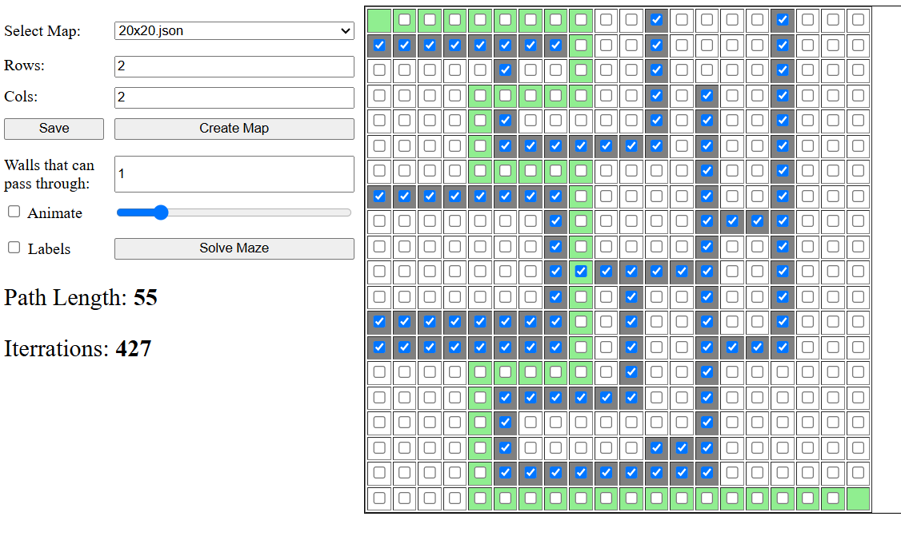
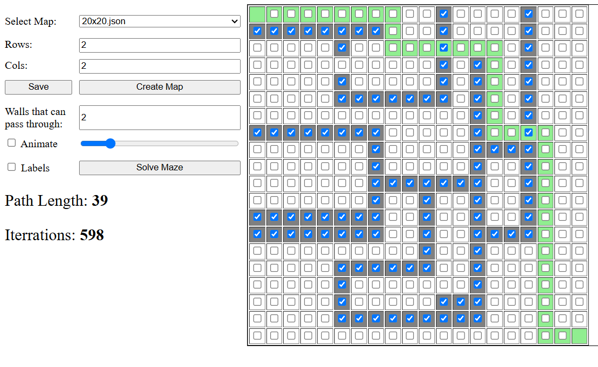

# Evaluation Project

## Installation

Make sure you have [PHP](https://www.php.net/downloads.php) and [Composer](https://getcomposer.org/) installed.  
To verify you can run `php -v` and `composer -h` in your terminal.

To install and set up the project, follow these steps:

1. Clone the repository:
    ```sh
    git clone https://github.com/anestorov/EvaluationTask.git
    ```
2. Navigate to the project directory:
    ```sh
    cd [EvaluationTask]
    ```
3. Install the required dependencies:

    ```sh
    composer install
    ```

\*Notice that data and vendors subdirectories should have write access

## 1: Advertising Bid Auction

According to me the main goal in this task, in order to achieve performance, was to use file pointer and traverse the csv file using **_fgetcsv()_** command. In this was I do not need to store file's content in memory and I can parse sigle row at a time.

In my solution I created a generic **CSV parser** class **_(lib/CsvParser.php)_** that accept any data Model class that extends Model Interface. Its parse function accepts filePath and a callback function that is envoked for each parsed row of the csv file. Parameter to the callback function is an instance of the data Model class passed to the constructor of the parser.

**BidFinder** calass implements the main logic behind finding the two maximum bids utilizing 2 class members $maxBidRecord and $secondMaxBidRecord and in does the work in **fild()** function

In this task I tried to follow **_SOLID principles_** and strict **_PHP types_** and **_DocBlock_** specifications for creating generic types reliable static analisis and code autocompletion.

### Run the code in CLI

Open your terminal, `cd` to the projects root directory and execute:

```sh
    php task1/run.php [filename]
```

\*Replace **[filename]** with the path to the input file containing the auction data.

CSV files should be located in **data/task1/** folder

Existing test files can be processed using the following commands

```
    php task1/run.php case1.csv
    php task1/run.php case2.csv
    php task1/run.php case3.csv
```

## 2: Word Frequency Counter

The main desing decision I made for that task was to create a **storage** with some sort of interprocess **mutex** that will solve any racing conditions when storing data or dirty reads which can occure when multiple processes read and write to that storage. Thats why I created **AtomicWriter** and **AtomicReader** classes to use **json file** as a cetralized storage and implemented setting blocking exclusive and shared locks to the storage file using **flock()**

For **counting of words** I utilize a hash map (PHP's associative array) inside **AtomicWriter** class where its key is the word and its value is the frequency of the word in record. Each instance of the classs loads the map in memory, process passed sentence to words, update their frequences and stores the map in an atomic way ensured by the file locking. That hash map iS stored as json encoded object in the srote file.

**AtomicReader** class ensures lock based retrival of the json object, converting it to a has map and performing efficient queries when searching for a word.

### Run the code in Browser

Open your terminal, `cd` to the projects root directory and execute the following to start your backend server.

```
composer task2
```

Then Open your browser to address http://localhost:8888 or http://127.0.0.1:8888

## 3: Escape a labyrinth

This task was very interesting. At first I realized that matrix labirinth can be represented as a graph and explored using BFS or DFS algorithms. Since the goal was to find the shortest path not just any path I had to choose **BFS**. However the requirement that a wall can be broken once was a bit challenging. My first thought was to produce multiple variations of the labirinth removing one wall cell at a time and exploring each one but that was very inefficient.

Then I realize that I can keep track of **multiple paths** to each explored node (labirinth cell) and also explore walls as valid nodes since they can be passed. So I designed it initially with 2 paths - one that represents a path not braking any walls and second path that represents passing through one wall. The idea was that when exploring a wall cell its path can be calculated by the non-wall-breaking path of its parent + the current cell. At that wall cell the non-wall-breaking path is discontinued and only its through-one-wall path contunues to be passed to its subsequent neightours. This led to the idea that I can store those paths in a array ordered by the number of walls it break. 0th index has non wall-breaking path, 1th index - one wall broken etc. So when exploring a wall cell I can set every n<sup>th</sup> path to its parent's n-1 path and discontinue the 0th path. This led to generalizing the algorithm and achiving a way to calculate the optimal path through variable number of walls.

The searching algorith is almost tipical **BFS** where it starts from the root none (labirinth entrance) and explore each neighbour by puting to a **FIFO Queue**. While the queue has entries or the end node is reached it pops elements out of the queue and compares it with its neighbourhs node's paths. If a shortest path is found the path is updated and node is re-queued for subsequent exploration of its neighbours.

For achiving more readible code I made 2 helper classes - **MazeNode** - which represents a labirinth cell or grapgh node and **MazePath** - representing each path to particular node as an array of MazeNodes

### Run the code UI in Browser

Open your terminal, `cd` to the projects root directory and execute the following to start your backend server.

```
composer task3
```

Then Open browser to address http://localhost:8888 or http://127.0.0.1:8888

#### Using that web UI users can create new maps of the labirinth, store and solve them

| Breaking 0 walls                 | Breaking 1 walls                 |
| -------------------------------- | -------------------------------- |
|  |  |

| Breaking 1 Wall                  | Breaking 2 walls                 |
| -------------------------------- | -------------------------------- |
|  |  |

*Animation feature can play back the solution  
*Labes help visualize every node path

### Run the code in CLI

```
php task3/run.php [MapFile]
```

Map files should be located in **data/task3/** folder

Existing test files can be processed using the following commands

```
    php task3/run.php case1.json
    php task3/run.php case2.json
    php task3/run.php case3.json
    php task3/run.php case4.json
```

## Testing

This project tests are located in **tests** directory arranged by tasks.

#### You can run all tests using

```
composer test
```

or

```
php vendor/bin/phpUnit
```
